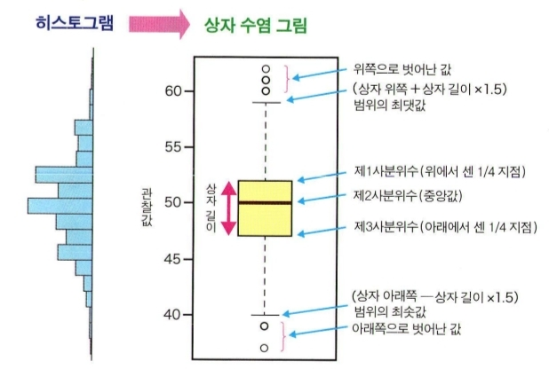
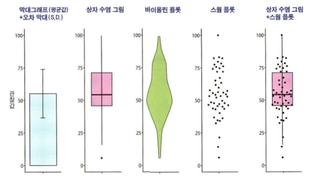
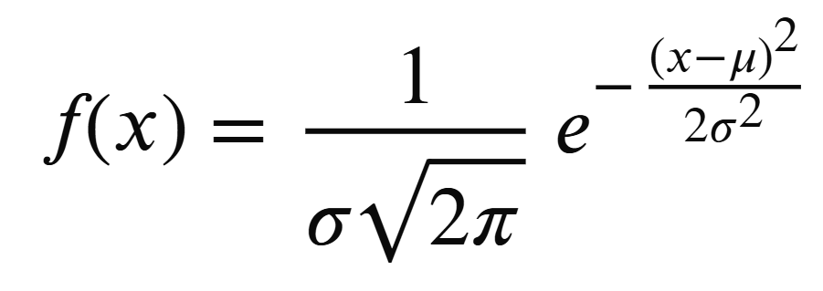

# 통계학 2주차 정규과제

📌통계학 정규과제는 매주 정해진 분량의 『*빅데이터 시대, 올바른 인사이트를 위한 통계 101×데이터 분석*』 을 읽고 학습하는 것입니다. 이번 주는 아래의 **Statistics_2nd_TIL**에 나열된 분량을 읽고 `학습 목표`에 맞게 공부하시면 됩니다.

아래의 문제를 풀어보며 학습 내용을 점검하세요. 문제를 해결하는 과정에서 개념을 스스로 정리하고, 필요한 경우 추가자료와 교재를 다시 참고하여 보완하는 것이 좋습니다.


## Statistics_2nd_TIL

### 3장 통계분석의 기초
#### 01. 데이터 유형
#### 02. 데이터 분포
#### 03. 통계량 
#### 04. 확률
#### 05. 이론적인 확률분포
### 4장 추론통계~신뢰구간 
#### 01. 추론통계를 배우기 전에
#### 02. 표본오차와 신뢰구간


## Study Schedule

| 주차  | 공부 범위     | 완료 여부 |
| ----- | ------------- | --------- |
| 1주차 | p.16~45    | ✅         |
| 2주차 | p.48~115   | ✅         |
| 3주차 | p.118~173  | 🍽️         |
| 4주차 | p.176~220 | 🍽️         |
| 5주차 | p.221~287 | 🍽️         |
| 6주차 | p.290~334 | 🍽️         |
| 7주차 | p.338~394 | 🍽️         |

<br>


# 1️⃣ 개념 정리 
## 01. 데이터 유형

```
✅ 학습 목표 :
* 기초적인 통계 용어에 대해 설명할 수 있다.
* 데이터 유형에 대해 이해한다.
```
**모집단과 표본**  
모집단을 분석하기 어렵기에 표본을 분석하고 모집단의 성질을 추론하는 추론통계를 함.

**변수**<br>
변수: 공통의 측정방법으로 얻은 같은 성질의 값, 개수에 따라 n변수 데이터 or n차원이라고 표현  
한 사람에 대한 여러 모든 변수의 데이터가 있어야 함, 고차원데이터는 분석 난도 높음.  

**다양한 데이터 유형**<br>
- 양적변수(수치형변수): 숫자로 나타낼 수 있는 변수, 계산 가능
  이산형: 점점이 있는 변수  
  연속형: 이어지는 값
- 질적변수(범주형변수) 계산 불가  


## 02. 데이터 분포

```
✅ 학습 목표 :
* 변수 유형에 따라 히스토그램 정의를 설명할 수 있다.
```

**그림으로 데이터 분포 확인하기** 히스토그램(도수분포도)  
그래프로 시각화해서 데이터 경향을 파악하는 것 필요  
- 이산형 양적변수의 히스토그램: 가로축-숫자, 세로축-데이터에 나타난 개수  
- 연속형 양적변수의 히스토그램: 범위에 따른 개수 표시
  * 구간폭(범위의 널이): 적절히 정해야 시각적으로도 분명하고 필요한 정보가 드러난 그림을 그릴 수 있다
- 범주형변수의 히스토그램: 가로축-범주, 세로축-범주에 속하는 개수  

**히스토그램은 그림으로 나타낸 것일 뿐**  
분포형태 확인, 이상값확인을 위해 필요하나 정확하지 않다. 시각화와 수치적분석 모두를 이용하여 상호보완적인 분석 필요


## 03. 통계량
```
✅ 학습 목표 :
* 통계량의 개념과 역할을 이해한다.
* 대푯값의 종류와 각 대푯값의 특성을 설명할 수 있다.
* 자료의 산포를 나타내는 분산과 표준편차의 의미를 이해한다.
* 이상값(이상치)의 개념과 통계 분석에서의 영향을 이해한다.
```
**데이터 특징 짓기**  
- 통계량: 데이터로 여러 계산을 수행하여 얻은 값  
  - 기술통계량(요약통계량): 데이터 그 자체의 성질 기술, 요약  
    주로 양적 변수를 대상으로 함, 범주형 변수는 개수 혹은 비율로만 ex) 평균값  
    -> 통계량은 정보의 일부를 버리는 것이 됨

**다양한 기술통계량**  
- 대푯값: 대략적인 분포위치, 대표적인 값 정량화하기 위해 사용 / 분포가 비대칭이라면 세 대푯값이 다를 가능성이 높음
  - (표본)평균값: 표본의 합/n, 엑스바
  - 중앙값: 크기 순으로 정렬했을 때 한가운데에 위치한 값, 짝수일 때는 중앙에 있는 두값의 평균값  
    극단적으로 크거나 작은 값(이상값)이 있어도 영향을 받지 않음
  - 최빈값: 데이터 중 가장 자주 나타나는 값, 전형적인 값은 무엇인가, 이상값은 빈도가 작아 최빈값에도 영향을 안 줌  
->대표값으로는 데이터를 이해하기 어려우므로 히스토그램을 확인해야함
 
- 분포의 폭: 데이터의 퍼짐정도
  - 표본분산: 표본의 각 값고 표본평균이 어느 정도 떨어져 있는지 평가하는 것, s^2 = (편차제곱의평균)  
    s^2 >=0 / 모든값이 같다면 0, 데이터 퍼짐 정도가 크면 s^2값이 커짐
  - 표본표준편차: 표본분산의 제곱근값

**분산을 확인할 수 있는 상자 수염 그림**  
  
중앙값, 사분위수, 최댓값, 최솟값 제시  
벗어난 값은 이상치  
히스토그램에서 보이는 상세한 분포형태정보는 포함하지 않음
<br>
<br>

- 막대그래프 + 오차막대: 막대그래프는 평균, 오차막대는 표준편차
- 바이올린플롯 / 스윔플롯: 분포를 자세히 시각화 가능
- 상자수염그림+스윔플롯: 두 그래프의 한계 보완, 통계량 표시+분포확인

**이상값**  
이상값: 극단적으로 크거나 작은 값  
명확한 정의는 없으나 평균값에서 표준편차의2배에서 3배 벗어난 숫자 or 박스플롯 상 이상치  
측정의 실수로 발생된 값인지 확인할 필요가 있음

## 04. 확률

```
✅ 학습 목표 :
* 확률의 기본 개념과 확률변수 및 확률분포의 의미를 이해한다.
* 추론통계에서 사용되는 확률분포의 개념을 이해한다.
* 사건 간 독립의 개념과 통계적 의미를 이해한다.
```
**확률을 배우기 전에**  
확률론은 현실에서 관찰한 데이터에 관한 것 X  

**확률의 기본 사고방식**  
- 확률: 발생여부가 불확실한 사건의 발생 가능성을 숫자로 표현한 것, 0=<P=<1,모든 사건의 확률의 합은 1  
  - 확률변수: 확률이 달라지는 변수, 이산형 or 연속형  
  - 실현값: 확률변수가 실제로 취하는 값
  
  - 확률분포: 가로축에 확률변수, 세로축에 확률변수의 발생 가능성 표시 분포
    - 확률밀도함수: 연속형 확률변수의 경우 범위를 두고 확률을 구해야 하는데 그 확률을 계산하는 함수  
      세로축은 확률 그 자체의 값이 아니라 상대적인 발생 가능성, 적분값 확률임  
  
 **추론통계와 확률분포**  
표본을 이용하여 모집단을 추정해야 함
모집단, 표본데이터 -> 확률분포, 실현값

- 기댓값: 양적확률변수의 경우 변수가 확률적으로 얼마나 발생하기 쉬운가를 평균적인 값으로 나타낸 것, 평균, E(x)
  - 이산형: (각 실현값과 그에 해당하는 발생 확률의 곱)의 합  
  - 연속형: (실현값X와 확률밀도 f(x)의 곱)을 적분한 값
- 분산: 확률분포가 기댓값 주변에 어느정도 퍼졌는지, V(x)  
  - 이산형: (각 실현값의 편차와 그에 해당하는 발생 확률의 곱)의 제곱의 합   
  - 연속형: (편차의 제곱과 확률밀도 함수의 곱)의 적분값 
- 표준편차: V(x)의 제곱근을 취한 값  
- 왜도(skewness): 분포가 좌우대칭에서 벗어난 정도
- 첨도(kurtosis): 분포가 얼마나뾰족한지, 그래프의 꼬리가 차지하는 비율 

**확률변수가 2개일 때**  
변수 간 관계를 파악 가능

- 동시확률분포 P(X, Y): 확률변수 2개를 동시에 생각할 때의 확률분포
<br>
- 독립: P(X, Y) = P(X) * P(Y)
  한쪽이 어떤 값을 취하든지 다른 한쪽의 발생확률은 변하지 않음
<br>
- 조건부확률 P(X\Y): 확률변수Y의 정보가 주어졌을때 다른 확률변수X의 확률
  IF) 독립인 경우 / P(X\Y) = P(X)

## 05. 이론적인 확률분포

```
✅ 학습 목표 :
* 모수의 개념과 통계적 의미를 이해한다.
* 정규분포의 특성과 표준화의 개념을 설명할 수 있다.
```

**확률분포와 파라미터**  
- 파라미터(모수): 확률분포를 식으로 나타낼 때 분포의 형태를 정하는 숫자  
  모집단을 'oo'이라는 파라미터를 가진 'ㅁㅁ'라는 확률분포'로 나타낼(근사할) 수 있어야 함  

**정규분포**  
- 정규분포(가우스분포) N(µ, σ^2): 평균과 표준편차라는 두개의 파라미터로 결정됨

  - µ: 평균, 분포의 위치 , σ: 표준편차, 분포의 넓이
  - 평균을 중심으로 한 종형 좌우대칭 분포
  - 평균에서 멀어질 수록 값이 적어짐
  - µ ± σ 사이 범위에 값이 있을 확률: 68%, µ ± 2σ 사이 범위에 값이 있을 확률: 95%, µ ± 3σ 사이 범위에 값이 있을 확률: 99.7%
  - 100%에서 해당 범위를 제하면 해당 범위 바깥의 확률값도 알수 있음
  - 표준정규분포: N(0, 1)

**표준화**  
- 표준화: 확률변수를 평균 0, 표준편차 1인 값으로 변환하는 방법, 변환된 새로운 값은 Z값이라고 함
  Z = (x - µ) / σ
  평균과 표준편차에 기준을 두고 데이터를 나열하는 것임

**다양한 확률분포**  
균등분포(연속, 이산), 이항분포(이산형), 푸아송분포(이산형), 음이항분포(이산형), 지수분포(연속형), 가우스분포(연속분포)  
검정통계량이 따르는 확률분포(t분포, F분포, x^2분포 -> 추론통계에서 사용)

## 06. 추론통계를 배우기 전에

```
✅ 학습 목표 :
* '데이터를 얻는다는 것'의 의미를 이해한다.
* 무작위추출의 개념과 통계적 필요성을 설명할 수 있다.
* 추론통계의 직관적 의미를 이해한다
```

**전수조사와 표본 조사**  
- 전수조사: 모집단의 모든 요소 조사, 기술통계 사용
- 표본조사: 표본을 이용해 모집단 추정, 추론통계 사용  

**데이터를 얻는다는 것**  
- 모집단 분포: 모집단을 나타내는 분포  
  -모수(파라미터): 모집단을 툭정짓는 양, 추론통계를 통해 추정하고자 하는 것 ex) 모평균, 모분산
<br>
- 확률분포와 실현값: 확률분포를 따르는 실현값이 발생하도록 할 수 있음  
  - 모집단= 확률분포 <-> 표본= 확률분포를 따르는 실현값  
  - "얻은 실현값으로 이 값을 발생시킨 확률분포를 추정한다"를 목표로  
- 모집단 분포 모형화: 현실세계의 분포를 수식으로 (근사하게) 기술
<br>
- 무작위 추출: 모집단에 포함된 요소를 하나씩 무작위로 선택하여 추출, 독립적으로  
  - 단순무작위추출법: 요소를 목록화하고 난수를 이용하여 표본 추출, 노력과 시간이 들 수도
  - 층화추출법: 몇 개의 층(집단)으로 나눈 후 각 층에서 필요한 수의 조사대상 무작위 추출
  - 계통추출법, 군집추출법 등  
- 편향되지 않게 추출하는 것이 중요  
- 모집단에 대해 추정한 결과를 어느 정도 일반화할 수 있는가는 도메인 지식에 따라 달라짐, 표본에서 얻은 결과를 모집단으로 일반화할 수 있는가 체크 필요

**추론통계를 직감적으로 이해하기**  
- 정말로 알고자 하는 것은 표본데이터가 아니라 모집단이다
- 전수조사는 어렵다
- 작은 크기의 표본으로도 모집단을 추론할 수 있다
- 표본을 추출할 때는 무작위로 추출해야 한다

## 07. 표본오차와 신뢰구간

```
✅ 학습 목표 :
* 표본오차의 개념을 이해한다.
* 중심극한정리의 기본 개념과 역할을 이해한다.
* 신뢰구간의 의미와 활용 방법을 이해한다.
```

**모집단과 데이터 사이의 오차 고려하기**  
모집단의 평균, 표준편차는 고정값 <-> 표본은 확률적으로 변하는 확률변수  

**포본오차**  
표본오차(표집오차): 알고 싶은 것과 실제로 분석한 데이터 사이의 오차, 필연적  

- 큰 수의 법칙: 표본크기 n이 커질수록 표본평균이 모집단 평균에 한없이 가까워짐, 표본오차(xbar-µ) 0으로 수렴  

****
****
****
****

<br>
<br>

# 2️⃣ 확인 문제

## 문제 1.

> **🧚Q. 한 기업이 신제품 출시 후 “소비자 전반의 만족도”를 파악하고자 한다.
이를 위해 전체 소비자 중 일부를 무작위로 선택해 설문을 실시했고, 평균 만족도가 높게 나타났다.
그러나 내부 회의에서 다음과 같은 의견이 나왔다.

“설문 결과가 좋으니, 우리 제품은 소비자 전체에게도 만족도가 높다고 결론 내려도 되지 않을까?”
> **이 결론의 타당성을 판단하기 위해 통계학적으로 가장 적절한 설명은 무엇인가?**

~~~
1️⃣ 일부 소비자를 조사했으므로 이는 전수조사이며, 결과는 그대로 신뢰할 수 있다.
2️⃣ 표본의 평균이 높게 나타났다면, 모집단의 평균도 반드시 높다고 볼 수 있다.
3️⃣ 표본이 모집단을 적절히 대표한다면, 표본 결과를 통해 모집단의 특성을 추론할 수 있다.
4️⃣ 데이터 분석의 목적은 결과를 빠르게 도출하는 것이므로 표본의 대표성은 중요하지 않다.
~~~
~~~
정답) 3️⃣ 표본이 모집단을 적절히 대표한다면, 표본 결과를 통해 모집단의 특성을 추론할 수 있다.
표본으로 모수를 추정한 값을 신뢰하려면 표본이 모집단을 충분히 대표할 수 있도록 추출되는 것이 전제조건이다.
~~~
